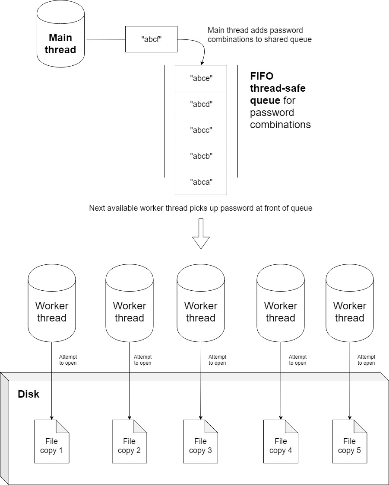

# File Cracker
A multi-threaded brute force attack tool for cracking password-protected files. Crack your file by trying up to 5000 passwords/second! Don't see your file format supported? Add it easily by following the instructions below.

## Usage

Clone the project and run the following in the root directory of the project:
```
python main.py
```
Then follow the on-screen prompts to provide information about your file

## How it works
<br>

<br>

### Multi-threaded script with thread pooling
File Cracker creates twice the number of threads as your CPU core count and pools them for unbeatable performance. Password combinations are fed into a shared thread-safe queue and picked-up by the first available thread. 

### Disk usage optimization for better performance
File Cracker optimizes disk usage by making multiple copies of the file and attempting to crack all of them at the same time. Each thread in the script gets its own copy of the file, allowing each process to work independently.

### Easily add support for new file formats
File Cracker is extremely scalable! It has been designed from ground-up to allow easy additions of new file formats without having to worry about any of the complex asynchronous stuff. Simply follow the instructions at the bottom of the page to add support for your file format. 

## Contributing
Pull requests are more than welcome! If you want to add support for new file formats, read the instructions below.

### Add support for a new file format
1. Create a new python file under `FileTypes` for your new file format
2. Use other files in that directory as a reference and create a function in your new file called `open` that takes the path to the file and a password as a parameter. Your function should attempt to open the file at the path with the given password, and return `True` if the password works or `False` otherwise.
3. In your new FileType python file, also add a list constant called `EXTENSIONS` that contains all the file extensions your new file type supports. For example `EXTENSIONS = [".xls", ".xlsx"]`
4. Finally, in `main.py`, import your new FileType file and add an instance of the class to the `FILE_TYPES` list constant
